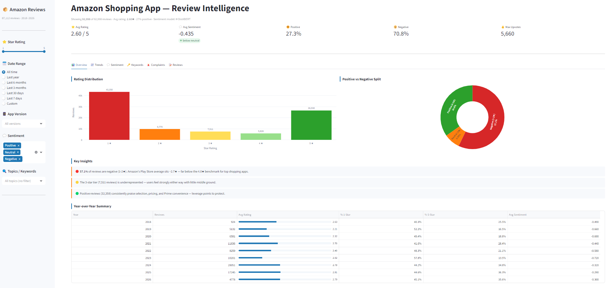
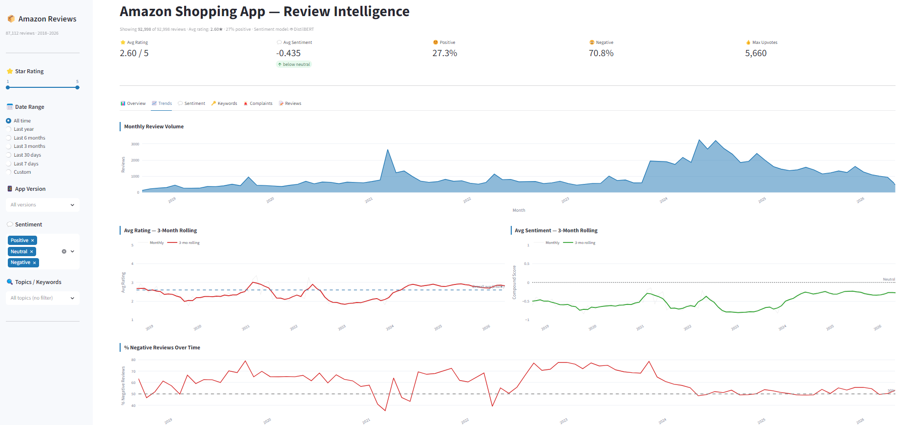
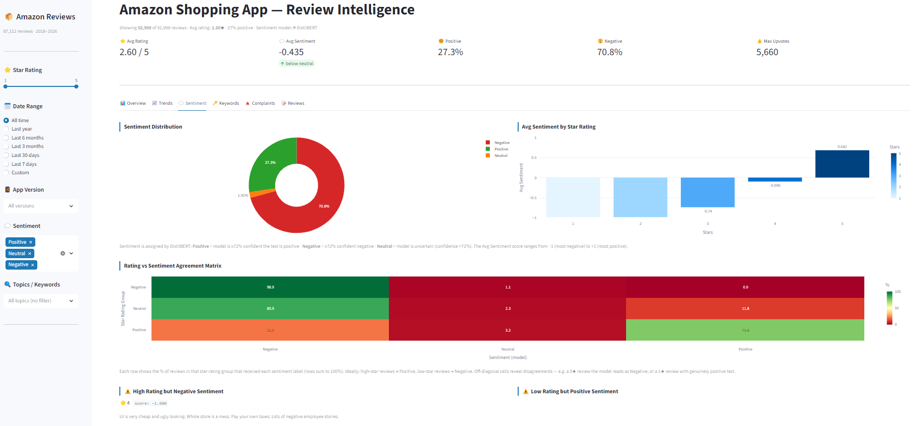
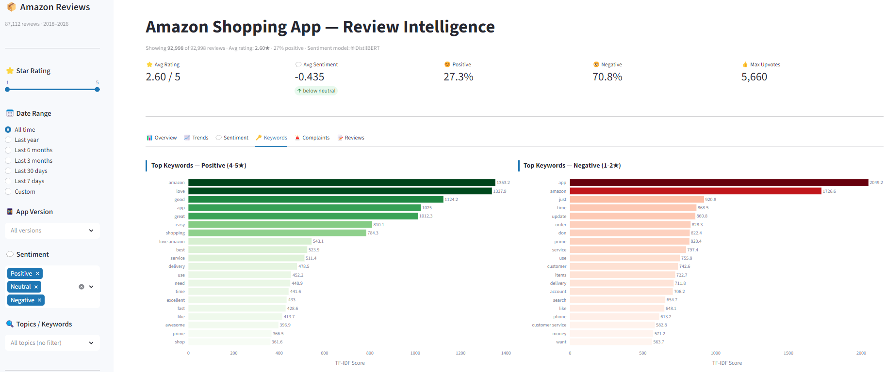
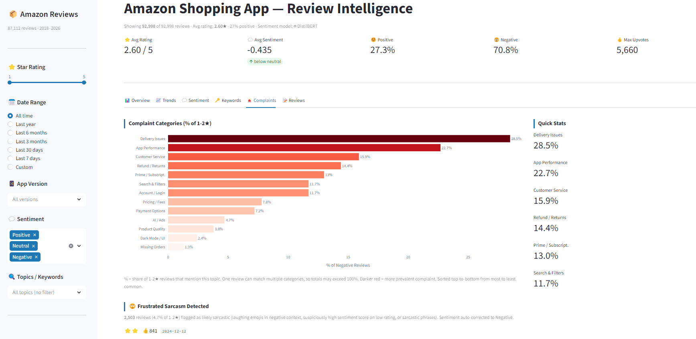
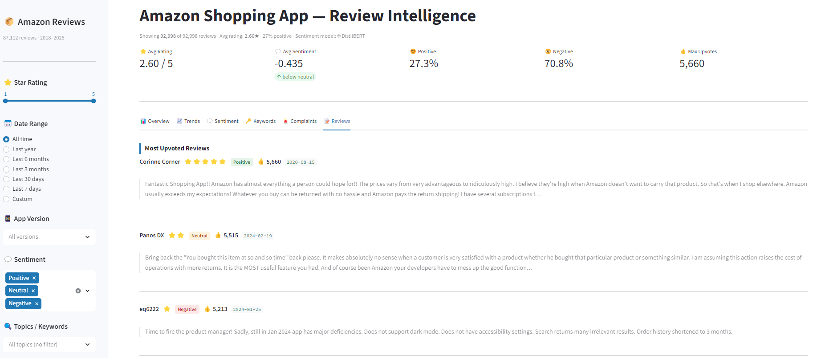

# Amazon Reviews Intelligence Dashboard


An interactive NLP dashboard analysing 87,112 Amazon Shopping app reviews (2018–2026) sourced from Kaggle. Applies DistilBERT for transformer-based sentiment scoring, TF-IDF keyword extraction, sarcasm detection, and complaint categorisation across six analytical tabs.

---

| Overview | Trends |
|---|---|
|  |  |

| Sentiment | Keywords |
|---|---|
|  |  |

| Complaints | Reviews |
|---|---|
|  |  |

---

## What it does

Star ratings are a noisy signal — a 1-star review can be sarcastic praise and a 5-star review can hide a genuine complaint. This dashboard applies contextual NLP to surface what users are actually saying, grouped by topic, version, and time period.

**Tabs:**

| Tab | Contents |
|---|---|
| **Overview** | Rating distribution, sentiment split, year-over-year table |
| **Trends** | Monthly volume, 3-month rolling rating & sentiment, % negative over time |
| **Sentiment** | DistilBERT label distribution, avg sentiment by star rating, rating/model agreement matrix, mismatch examples |
| **Keywords** | TF-IDF distinctive keywords for positive vs. negative reviews, word clouds |
| **Complaints** | 13 auto-categorised complaint topics, sarcasm detection, positive theme breakdown, version performance |
| **Reviews** | Paginated, multi-sort review browser with sentiment tags |

**Sidebar filters:** star rating · date range (presets + custom) · app version · sentiment label · topic keyword

---

## Architecture

```
┌──────────────────────────────────────────────────────────────────────┐
│  Data source: Kaggle                                                 │
│  amazon_reviews.csv  ·  87,112 reviews  ·  2018 – 2026             │
└───────────────────────────────┬──────────────────────────────────────┘
                                │
                                ▼
┌──────────────────────────────────────────────────────────────────────┐
│  compute_sentiment.py  (run once locally)                            │
│                                                                      │
│  DistilBERT: distilbert-base-uncased-finetuned-sst-2-english        │
│  • Batch size 32  ·  128-token truncation  ·  CPU or CUDA           │
│  • Confidence < 72 %  →  Neutral  (calibrated threshold)           │
│                                │                                     │
│                                ▼                                     │
│               analysis/sentiment_cache.parquet                       │
└───────────────────────────────┬──────────────────────────────────────┘
                                │
                                ▼
┌──────────────────────────────────────────────────────────────────────┐
│  utils/preprocessing.py                                              │
│  • Merge Parquet cache with raw CSV                                  │
│  • VADER fallback for uncached rows                                  │
│  • Sarcasm detection & sentiment correction                          │
│  • TF-IDF keyword extraction  (scikit-learn)                        │
│  • Rule-based complaint & theme classification                       │
└───────────────────────────────┬──────────────────────────────────────┘
                                │
                                ▼
┌──────────────────────────────────────────────────────────────────────┐
│  app.py  —  Streamlit dashboard                                      │
│  6 tabs  ·  Plotly charts  ·  Sidebar filters                       │
└──────────────────────────────────────────────────────────────────────┘
```

---

## Dataset

| Field | Description |
|---|---|
| `reviewId` | Unique review identifier |
| `content` | Raw review text |
| `score` | Star rating (1–5) |
| `at` | Review timestamp |
| `thumbsUpCount` | Community upvotes |
| `appVersion` | App version at time of review |
| `userName` | Reviewer display name |

Source: [Amazon Shopping Reviews (Daily Updated)](https://www.kaggle.com/datasets/ashishkumarak/amazon-shopping-reviews-daily-updated) on Kaggle. The dataset is included in this repo as `amazon_reviews.csv`.

---

## Sentiment methodology

### DistilBERT (primary)

`distilbert-base-uncased-finetuned-sst-2-english` — 66 M parameters, fine-tuned on Stanford Sentiment Treebank.

The model outputs a binary label (`POSITIVE` / `NEGATIVE`) with a confidence score. Anything below 72 % confidence is labelled **Neutral** — this captures genuinely mixed reviews ("delivery was fast but the item was damaged") that a forced binary label would misrepresent. Results are pre-computed once and loaded from a Parquet cache at startup.

### VADER (fallback)

If no Parquet cache is present, the app falls back to VADER in real time. The dashboard header shows which model is active — `🤖 DistilBERT` or `⚠️ VADER`.

### Comparison

| | VADER | DistilBERT |
|---|---|---|
| Type | Lexicon / rule-based | Transformer (fine-tuned) |
| Speed | Real-time | ~10–20 min / 87 K reviews on CPU |
| Negation | Heuristic | Contextual |
| Neutral | Fixed compound threshold | Calibrated confidence threshold |
| Sarcasm | Fails | Partially handles via context |

---

## Sarcasm detection

Low-star reviews with suspiciously positive language are flagged using three signals:

1. Laughing / eye-roll emojis (😂 🤣 🙄) paired with a positive model score
2. Compound score > 0.45 on a 1–2-star review
3. Explicit sarcasm phrases — *"what a joke", "well done Amazon", "thanks for nothing"*, etc.

Flagged reviews have their sentiment overridden to Negative and their compound score negated. The Complaints tab lists the most upvoted flagged reviews.

---

## Key findings

- The app averages ~2.7 ★ across 87 K reviews — well below the 4.0 ★ benchmark for top shopping apps
- The 3-star tier is significantly underrepresented; users tend to feel strongly in one direction
- Top complaint themes: delivery delays, missing orders, refund friction, app crashes, and unresponsive customer support
- Rating quality shifts noticeably across app versions — visible in the version performance breakdown
- A share of 5 ★ reviews contain text the model reads as negative, and vice versa — the Sentiment tab agreement matrix shows where star rating and NLP disagree

---

## Setup

### Install

```bash
git clone https://github.com/your_username/amazon-reviews-nlp-dashboard.git
cd amazon-reviews-nlp-dashboard
pip install -r requirements.txt          # app only
pip install -r requirements-dev.txt      # + DistilBERT and notebook tools
```

### Pre-compute sentiment

```bash
python compute_sentiment.py
```

Downloads the model (~67 MB) and scores all reviews. Takes 10–20 min on CPU, under 2 min on GPU. Writes `analysis/sentiment_cache.parquet`. Skip to use VADER fallback.

### Run

```bash
streamlit run app.py
```

---

## Streamlit Community Cloud

Connect the repo at [share.streamlit.io](https://share.streamlit.io), set `app.py` as the main file. No secrets needed. The committed Parquet cache means the deployed app runs on DistilBERT scores without any inference step.

---

## Project structure

```
amazon-reviews-nlp-dashboard/
├── app.py                       # Streamlit dashboard
├── compute_sentiment.py         # DistilBERT scoring script
├── requirements.txt             # App dependencies
├── requirements-dev.txt         # Dev dependencies (DistilBERT + notebook)
├── .streamlit/config.toml       # Theme and server config
├── utils/
│   └── preprocessing.py         # Data loading, sentiment, TF-IDF, filters
├── analysis/
│   ├── amazon_analysis.ipynb    # EDA notebook
│   └── sentiment_cache.parquet  # Pre-computed scores
└── screenshots/
```

---

## Possible extensions

- Replace rule-based complaint categories with BERTopic for unsupervised topic discovery
- Aspect-based sentiment — score delivery, quality, price separately per review
- Automated refresh from updated Kaggle exports to keep the dataset current
- UMAP visualisation of review embeddings coloured by sentiment cluster

---

`Python` · `Streamlit` · `DistilBERT` · `Plotly` · `scikit-learn` · `VADER` · `pandas` · `pyarrow` · `wordcloud`
